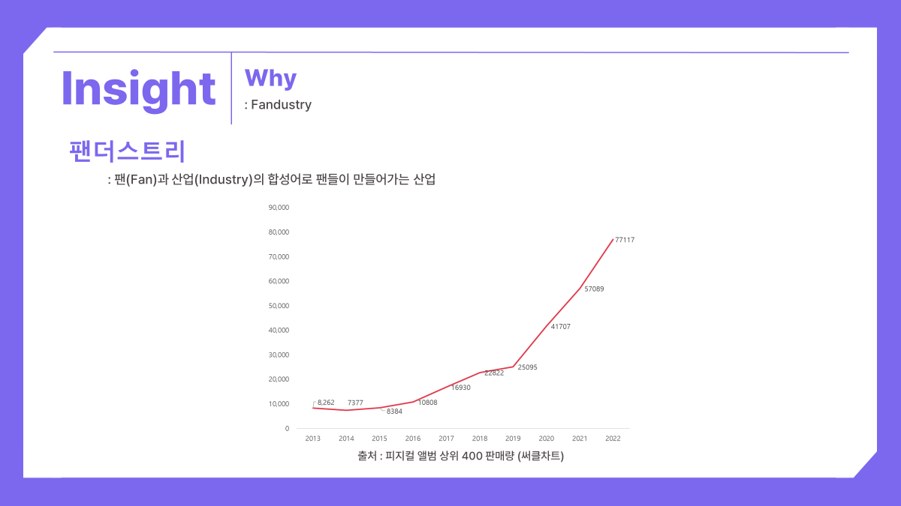

# README

날짜: 2023년 8월 20일

## 목차

- [기획배경](#🎤기획배경)
- [기획](#🎤기획)
  - 와이어프레임
  - UI디자인
  - ERD
- [주요기능](#🎤주요기능)
- [기술스택](#🎤기술스택)
- [개발환경](#🎤개발환경)
  - Git flow 전략
  - 컨벤션
- [서비스구조](#🎤서비스구조)
  - 아키텍쳐
  - 디렉토리 구조
- [시작하기](#🎤시작하기)
- [만든사람들](#👩‍🎤만든사람들)

---

# 🎤기획배경

- K-POP 시장이 점점 커져감에 따라 팬 활동을 위한 다양한 플랫폼이 출시되었다.
- 하지만 각각의 플랫폼에서 제공하는 서비스가 상이하고, 모든 아티스트들이 플랫폼에 입점되어있지 않기 때문에 사용자들은 필요한 플랫폼에 모두 가입을 하여 이용을 할 수 밖에 없다.
- 이러한 불편함을 해소하기 위해 주요 3사(위버스, 버블, 유니버스)에서 제공하는 특징적 서비스를 모은 플랫폼을 기획하였다.




# 🎤기획

## 와이어프레임

> 🔗[Figma에서 보기](https://www.figma.com/file/WmPoaPLYunxK8kttF05zs7/Wireframe?type=design&node-id=0-1&mode=design&t=vKHBn1Uly5IuioSf-0)


## UI 디자인 (프로토타입)

> 🔗[Figma에서 보기](https://www.figma.com/file/WmPoaPLYunxK8kttF05zs7/Wireframe?type=design&node-id=122-116&mode=design&t=vKHBn1Uly5IuioSf-0)

### 메인 페이지


### 상세 페이지


## UI 디자인

### 메인 페이지


### 상세페이지

(1) 팬 피드


(2) 아티스트 피드


(3) 온라인 콘서트


(4) 영상통화 팬사인회


## ERD

> 🔗[ERDCloud에서 보기](https://www.erdcloud.com/d/35ZjvmR6ZX95YquSP)


# 🎤주요기능

### 1. 포스트 작성, 댓글 작성, 좋아요, 북마크

### 2. 아티스트 라이브 방송

### 3. 영상통화 팬싸인회

### 4. 온라인 콘서트

### 5. 공개방송 현장참여 신청

### 4. 상품 구매

```markdown
## 실시간 화상 통화 시스템 - openvidu

아티스트 라이브 방송, 영상통화 팬싸인회, 온라인 콘서트 기능에 적용된 기술이다.

openvidu - ICE, 시그널링, 미디어 서버 같은 하위 수준 구현을 래핑하고 메시지 브로드캐스트, 화면 공유와 같은 기능을 포함한 코드를 제공해서 간단하게 화상 회의 애플리케이션을 개발할 수 있도록 하는 프레임워크이다. kurento 라는 미디어 서버를 한 번 더 래핑해서 내부 구현을 몰라도 된다는 장점이 있다.

kurento - 웹/모바일 환경에서 비디오 애플리케이션을 개발할 수 있도록 하는 WebRTC의 미디어 서버이다.

webRTC - 웹 브라우저가 서로 통신할 수 있도록 설계된 API로 웹 브라우저 상에서는 다른 플러그인 없이 음성 채팅과 화상 채팅, 데이터 교환을 지원한다.
```

# 🎤기술스택


| Domain   | Name        | Version |
| -------- | ----------- | ------- |
| Frontend | React       | 2.6.11  |
| Frontend | Node.Js     | 2.4.0   |
| Backend  | Springboot  | 2.7.13  |
| Backend  | MySql       | 8.0.34  |
| Backend  | Java        | 11.0.19 |
| Backend  | OpenVidu    | 2.28.0  |
| Backend  | Redis       | 7.0.12  |
| Backend  | Spring Boot | 2.7.13  |

# 🎤개발환경

[GIT Flow 전략](https://www.notion.so/GIT-Flow-5258aec9c7074545bba98d4dc8f77f13?pvs=21)

[깃 커밋 컨벤션](https://www.notion.so/9b78aa5d553441e1a57c1936481e37e8?pvs=21)

[권한 관련 컨벤션](https://www.notion.so/9061be88523844f68ab9fdd942970f60?pvs=21)

[코드 스타일](https://www.notion.so/d44649cbf88b4a0a9cc02717c5452651?pvs=21)

[[BE] CSR 관련 컨벤션](https://www.notion.so/BE-CSR-c64c7dddbc7d4c3d91193a102ffdb503?pvs=21)

[[FE] 코드 컨벤션](https://www.notion.so/FE-fc65e17ad4a5468881146cff7c4b5410?pvs=21)

# 🎤서비스구조

### 아키텍쳐

### 디렉토리 구조

```markdown
.
├──📁backend // 백엔드
└──📁frontend // 프론트엔드
```

### 디렉토리 구조 - Frontend

```markdown
📁frontend
├──📁src
│ ├──📁assets
│ │ ├──📁icons
│ │ ├──📁images
│ │ └──📁loading
│ │
│ ├──📁components
│ │ ├──📁auth // 로그인
│ │ ├──📁common // 기타 기능
│ │ ├──📁fanfeed // 팬 피드
│ │ ├──📁groupfeed // 아티스트 피드
│ │ ├──📁live // 라이브
│ │ │ └──📁chat // 라이브 채팅
│ │ ├──📁main // 메인화면
│ │ ├──📁media // 영상 관련 기능
│ │ │ ├──📁fanSigning // 팬 사인회
│ │ │ │ └──📁openvidu // 팬 사인회 영상
│ │ │ ├──📁onlineconcert // 온라인 콘서트
│ │ │ │ ├──📁chat // 온라인 콘서트 채팅
│ │ │ │ └──📁openvidu // 온라인 콘서트 영상
│ │ ├──📁mypage // 마이페이지
│ │ │ ├──📁bookmark // 북마크
│ │ │ ├──📁myActivity // 내 활동
│ │ │ ├──📁purchase // 구매 내역
│ │ │ ├──📁sidebar // 스크롤
│ │ │ └──📁userinfo // 사용자 정보
│ │ ├──📁others // others 탭
│ │ │ ├──📁announcement // 공지사항
│ │ │ ├──📁membershipOnly // 멤버십 전용 컨텐츠
│ │ │ └──📁openlive // 공방 신청
│ │ └──📁shop // 구매 내역
│ │
│ ├──📁fonts
│ │
│ ├──📁socialLoginLogo
│ │
│ ├──📁style
│ │ ├──📁auth // 로그인
│ │ ├──📁common // 기타 기능
│ │ ├──📁fanfeed // 팬 피드
│ │ ├──📁groupfeed // 아티스트 피드
│ │ ├──📁live // 라이브
│ │ │ └──📁chat // 라이브 채팅
│ │ ├──📁main // 메인화면
│ │ ├──📁media // 영상 관련 기능
│ │ │ ├──📁fanSigning // 팬 사인회
│ │ │ │ └──📁openvidu // 팬 사인회 영상
│ │ │ ├──📁onlineconcert // 온라인 콘서트
│ │ │ │ ├──📁chat // 온라인 콘서트 채팅
│ │ │ │ └──📁openvidu // 온라인 콘서트 영상
│ │ ├──📁mypage // 마이페이지
│ │ │ ├──📁bookmark // 북마크
│ │ │ ├──📁myActivity // 내 활동
│ │ │ ├──📁purchase // 구매 내역
│ │ │ ├──📁sidebar // 스크롤
│ │ │ └──📁userinfo // 사용자 정보
│ │ ├──📁others // others 탭
│ │ │ ├──📁announcement // 공지사항
│ │ │ ├──📁membershipOnly // 멤버십 전용 컨텐츠
│ │ │ └──📁openlive // 공방 신청
│ │ └──📁shop // 구매 내역
│ │
│ ├──📃App.css
│ ├──📃App.js // 기본 앱
│ ├──📃index.cs
│ └──📃index.js // 라우터
│
├──📃.gitignore
├──📃jsconfig.json
├──📃package.json // 패키지 의존성 관리
├──📃package-lock.json // 패키지 의존성 관리
└──📃README.md
```

### 디렉토리 구조 - Backend

```markdown
📁backend
├──📁src/main
│ ├──📁java/com/mk/ourola
│ │ ├──📁api
│ │ │ ├──📁admin
│ │ │ ├──📁artist
│ │ │ ├──📁common
│ │ │ │ ├──📁auth
│ │ │ │ │ ├──📁filter // JWT
│ │ │ │ │ ├──📁handler // 로그인 핸들러
│ │ │ │ │ └──📁oauth2 // 소셜 로그인 관리
│ │ │ │ ├──📁file
│ │ │ │ ├──📁openvidu
│ │ │ │ └──📃Role.java // 역할 정리
│ │ │ ├──📁fan
│ │ │ ├──📁feed
│ │ │ ├──📁group
│ │ │ ├──📁live
│ │ │ │ └──📁chatting
│ │ │ ├──📁media
│ │ │ │ ├──📁onlinecall
│ │ │ │ └──📁onlineconcert
│ │ │ ├──📁membership
│ │ │ ├──📁mypage
│ │ │ │──📁others
│ │ │ │ ├──📁announcement
│ │ │ │ └──📁openlive
│ │ │ │ │ └──📁redis // 공개방송 신청 시 동시 신청 제어
│ │ │ └──📁shop
│ │
│ └──📁config
│ │ ├──📃SecurityConfig.java // Spring Security 설정
│ │ └──📃WebsocketConfig.java // WebSocket 설정
│
└──📃OurolaApplication.java // 백엔드 기본 앱

// 각 파일엔 Controller, Service, Repository 존재
```

# 🎤시작하기

### 프로젝트 설치

```bash
$ git clone <https://lab.ssafy.com/s09-webmobile1-sub2/S09P12D204.git>
$ cd ourola
```

## front

```bash
$ cd frontend
$ npm install
$ npm run serve
```

## back

```bash
$ cd backend
$ sudo chmod +x gradlew
$ sudo ./gradlew clean build
$ sudo java -jar /build/libs/ourola-0.0.1-SNAPSHOT.jar
```

## DB

exec 폴더 안 Ourola DB Dump 파일 실행

# 👩‍🎤만든사람들

## SSAFY 9기 구미 4반 D204팀

### 팀명 - 금지”어?”

- 별 것 아닌 일로 “어?” 금지

### 팀원


